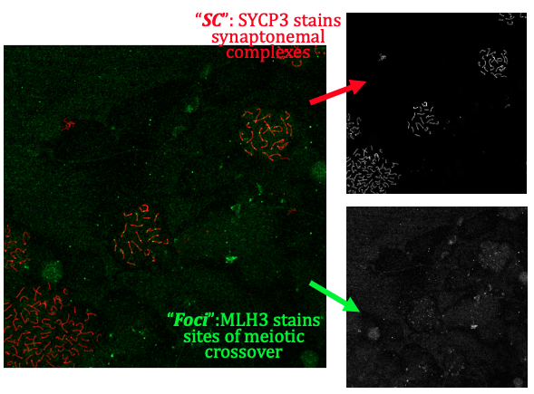
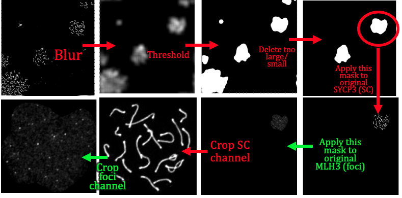
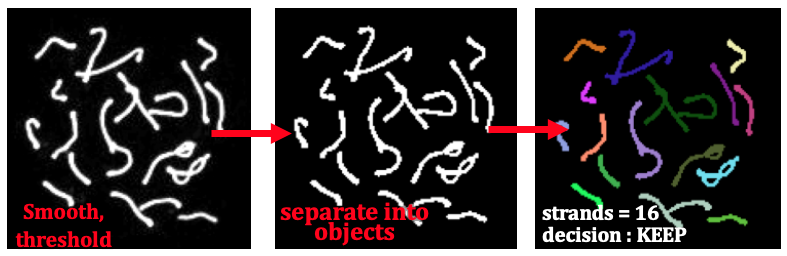
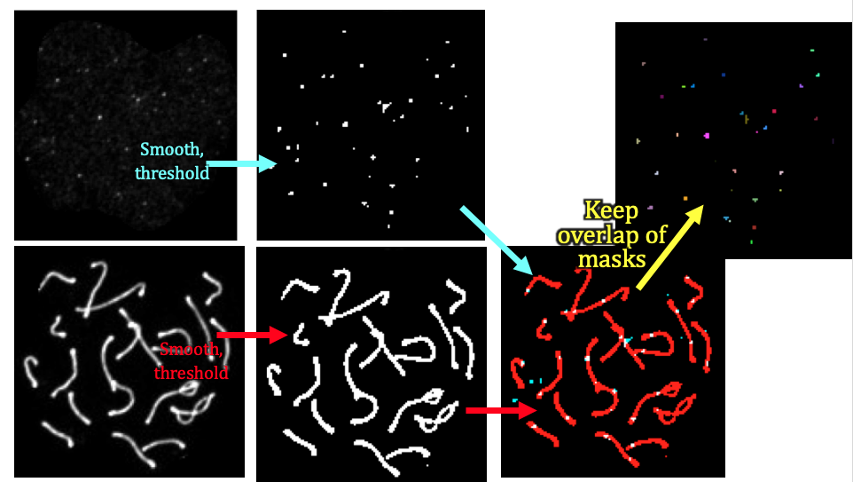
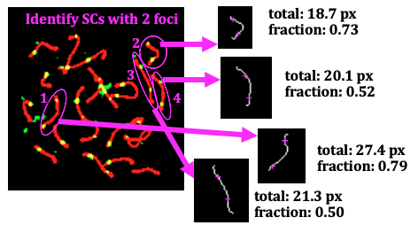
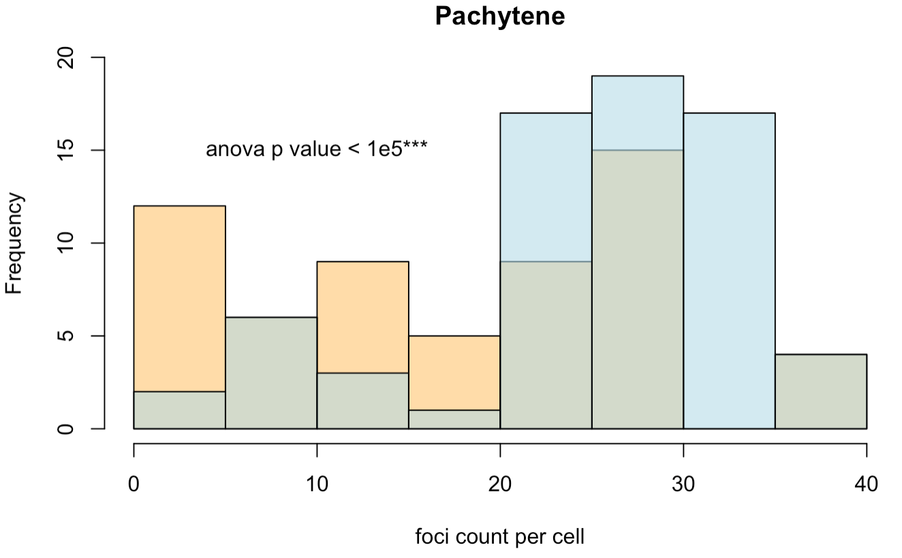
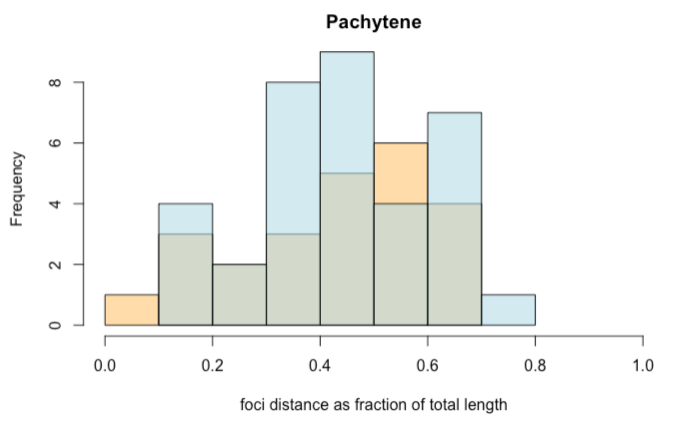
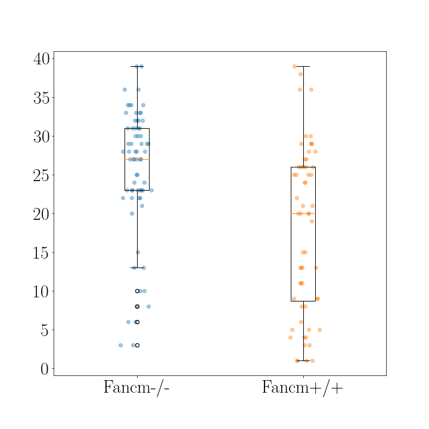
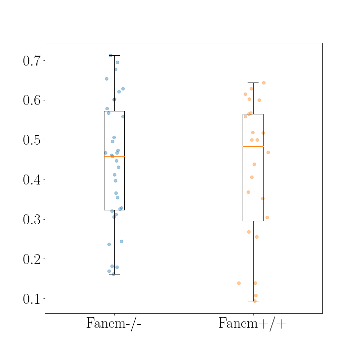

# synapsis

## Installing `synapsis`

`synapsis` will be available on [bioconductor](https://www.bioconductor.org). For now, please download from the [github](https://gitlab.svi.edu.au/lmcneill/synapsis) repository using

```r
# install from gitlab
devtools::install_git('https://gitlab.svi.edu.au/lmcneill/synapsis')
```

This package depends on `EBImage` which has some external dependencies.

## Project overview

synapsis is an R package for analysing fluorescent microscopy images. In particular, its intended use is for analysing meiotic processes in mammals.

The main goal is to objectively count the number of meiotic crossovers on a per cell basis, in line with recent developments in ImageJ software. However, unlike using ImageJ, synapsis does not require a scientist to manually crop images around cells of interest in order to count "foci" (crossover sites).

Instead, synapsis identifies "viable" cells in all images of a data set, crops around each per image, and then performs counting.

A single two channel image might look like the left colour image in the following figure:



*Figure 1: a two channel image of a meiotic spread. Antibody stains are SYCP3 (red, illuminates synaptonemal complexes) and MLH3 (green, illuminates sites of meiotic crossovers). Image taken by Vanessa Tsui in 2020.*

which can also be separated into the two channels (greyscale, right).

Synapsis can take this image (or folders of images like this) and determine the number of coincident foci (green) with synaptonemal complexes ("SCs", red) per cell.


[comment]: <> (examples with this file MLH3rabbit488_SYCP3mouse594_fancm_fvb_x_fancm_bl6_725--_slide01_018.nd2)

## Contributors

Lucy McNeill, St Vincent's Institute of Medical Research

Wayne Crismani, St Vincent's Institute of Medical Research and the University of Melbourne

## Compatibility

synapsis relies heavily on the `bioconductor` package `EBImage`, which currently supports jpeg, png and tiff image files.

Currently, synapsis also supports

- [x] .nd2 (NIKON), see [nd2converter.py][], which converts a three channel image into three separate jpegs of foci, SC and DAPI (unused) channels from original .nd2 files.


## Using synapsis

synapsis has four main functions. These are:

- auto_crop

- get_pachytene

- count_foci

- measure_distances

We summarise them in the following subsections:

### auto_crop


input: Path to original grey scale image files of (1) Synaptonemal complexes ("SC", e.g. SYCP3 anti-body) (2) foci (e.g. MLH1, MLH3 anti-body) and (3) cell boundary structure (e.g. DAPI stain) channels from e.g. Nikon .nd2 files. See setup vignette for the details of getting files ready.

output: crops in SC (red) and foci (green) around individual cells.

Calling auto_crop:

```r
# using auto_crop
auto_crop_fast(path)
```

In the following figure, we show how synapsis automatically crops around a single "good" cell, starting with the original images of the two channels in Figure 1, from start to finish.



*Figure 2: workflow for the auto_crop function. We start with the SC channel (red in Figure 1), and after gaussian smoothing and thresholding, we create a "mask" for each viable cell, i.e. based on brightness. Next we delete candidate cells which are too large (overlapping cells), too small, too oblong (cells on the edge, too dim) etc. Then, we apply each mask on both the SC channel, and the foci channel (green in Figure 1) to isolate single cells of interest. Finally, for each remaining viable single cell, we crop both the SC and foci channel around each single cell.*

### get_pachytene

input: crops in channels (1) (red) and (2) (green) around individual cells, from previous auto_crop.

output: only keeps crops if cells are in pachytene phase (based on channel (1))

get_pachytene makes a mask of the SC channel (red in Figure 1), and then excludes images which have more objects compared to the expected number of synaptonemal complexes expected (22 for mice).

In summary, get_pachytene filters out any "good" cells determined by auto_crop (Figure 2) which are not during the pachytene phase, since the procedure favours bright, uniform intensity SC channels. These steps are shown in the following figure.



*Figure 3: workflow for the get_pachytene function. We start with the SC channel (red in Figure 1). After gaussian smoothing, followed by thresholding, we create a "mask" for the synaptonemal complexes (SCs), which during pachytene phase are (uniformly) bright. Then, the number of SCs (identified individual SCs are coloured in unique colours) is counted. If it exceeds the expected number for the species (22 for mice) then we discard it. This works, because the SCs in discarded images (during other phases) are generally less bright/ uniform/ uniformly bright, and smoothing and thresholding leaves (grainy) strands being identified as multiple objects.*

### count_foci

input: crops of SC and foci channels in pachytene phase (from get_pachytene)

output: number of foci counts of synaptonemal complexes per cell (i.e. channel 1 coincident with channel 2) as a function of genotype.

In the next figure, we summarise how synapsis counts foci for a cell. It takes the two crops around single "good" cells in SC and foci channel (bottom left two panels in Figure 2), from auto_crop and get_pachytene functions. Then, each channel is gaussian smoothed and thresholded. A new mask is created from the overlap of these two masks, i.e. white corresponds to a foci colocalised onto an SC. Finally, individual objects in the mask are identified and counted.



*Figure 4: workflow for the count_foci function. We start with the two crops of the foci and SC channels found in Figure 3. These are also subject to gaussian smoothing followed by thresholding, and then the overlap of these two masks is determined (upper right, multicoloured spots). The function returns the number of coincident foci for this cell.*

### measure_distances

input: crops of SC and foci channels in pachytene phase (from get_pachytene)

output: a measure of the separation between two foci in the case that they are on the same synaptonemal complex in the SC channel (red).

The following figure shows a summary of the measure_distances function. Once we have masks of both the SC and foci channel (Figure 3), we take all the objects in the SC channel which colocalise with TWO foci (circled in magenta). Then, for each of these SCs (four in total in Figure 5), synapsis locates a bright spot on the SC to start drawing a line from. Walkers in two directions move away from this point, guided by the direction of maximum brightness. Eventually, a white line is traced out that runs through the middle of an SC. Then, the locations on this line which are closest to the foci on the SC are calculated, and shown with magenta crosshairs. The total distance (in pixels) of the SC (white line) is calculated (by ascribing a value of 1 to horizontal and vertical movements, and sqrt(2) to diagonal movements between pixels) and then the pixel distance between foci is also measured.



*Figure 5: Input and output of the measuring_distance function, for the four SCs that synapsis identifies as having two foci per SC, in this cell. The total length (in pixels) of an SC (white line) is calculated, and the closest point on this line to the foci locations in the original image (left) are drawn with magenta crosshairs. The pixel distance between the two magenta foci locations is calculated. Finally, the function outputs a measure of the distance relative to its own length, i.e. (distance between foci)/(total length of SC).*

## Analysis

Once we have the foci counts (count_foci) and/or distance between foci along synaptonemal complexes (measure_distances), we can generate

- Histograms



*Figure 6: Histogram of foci counts per cell (procedure in Figures 2 and 3) as a function of genotype (wildtype in orange, mutant in blue). The populations are significantly different (p value < 0.05 with anova test) with the mutant having 20 percent more foci per cell (on average).*



*Figure 7: Histogram of (fractional) distances between foci on an SC (procedure summary in Figure 5) as a function of genotype (wildtype in orange, mutant in blue). The groups are not significantly different and could reasonably have come from the same population.*

- Boxplots



*Figure 8: Boxplot of foci counts per cell as a function of genotype (wildtype in orange, mutant in blue). The populations are significantly different (p value < 0.05 with anova test) with the mutant having 20 percent more foci per cell (on average).*



*Figure 9: Boxplot of (fractional) distances between foci on an SC (procedure summary in Figure 5) as a function of genotype (wildtype in orange, mutant in blue). The groups are not significantly different and could reasonably have come from the same population.*

- Measures of statistical significance

with e.g. ANOVA testing.


## Project organisation and management

Please [issue][] bug reports through GitLab.


## Acknowledgements

This project is a [workflowr][] project, where we make use of a [project template][] created by Davis McCarthy.

[workflowr]: https://github.com/jdblischak/workflowr

[project template]: https://gitlab.svi.edu.au/biocellgen-public/aaaa_2019_project-template

[issue]: https://gitlab.svi.edu.au/lmcneill/synapsis/-/issues

[nd2converter.py]: https://gitlab.svi.edu.au/lmcneill/synapsis/-/blob/master/source/nd2converter.py
