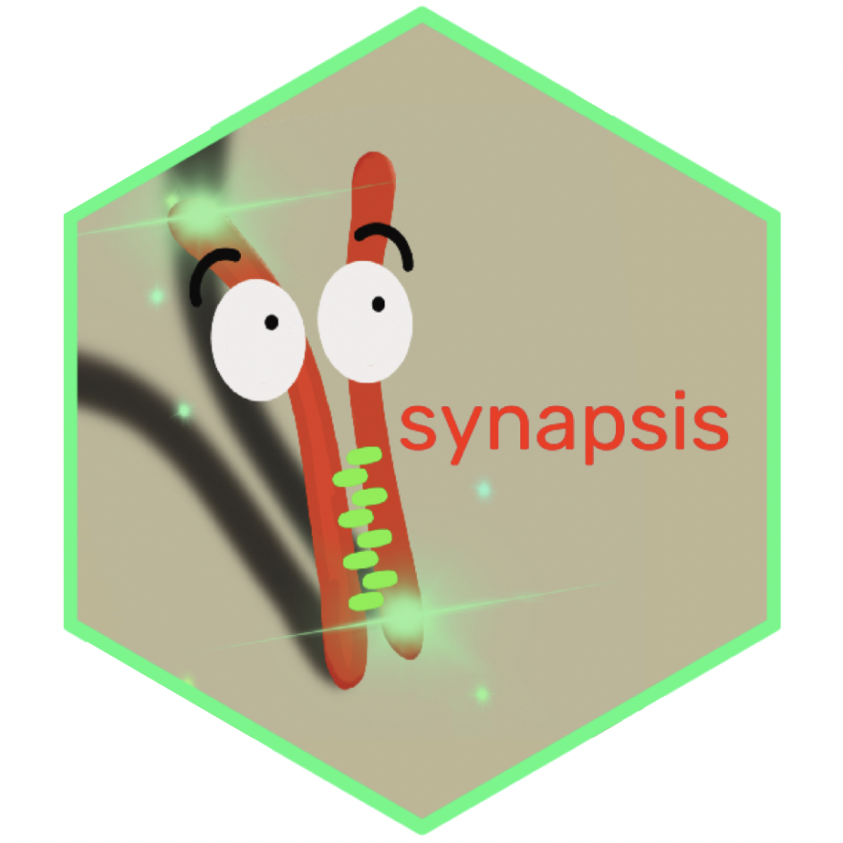

# synapsis

## Installing `synapsis`



`synapsis` will be available on [bioconductor](https://www.bioconductor.org). For now, please download from the [github](https://gitlab.svi.edu.au/lmcneill/synapsis) repository using

```r
# install from gitlab
devtools::install_git('https://github.com/mcneilllucy/synapsis')
```

This package depends on `EBImage` which has some external dependencies.
