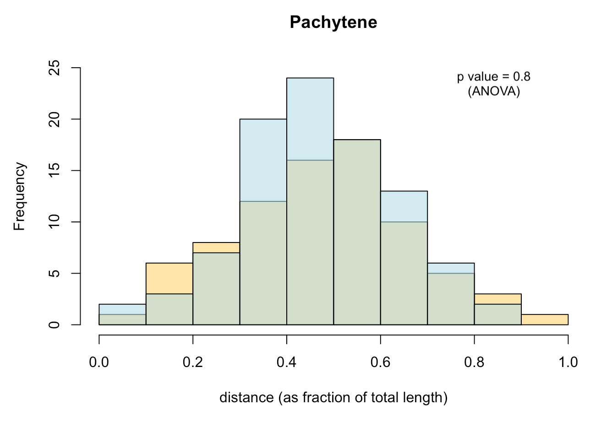
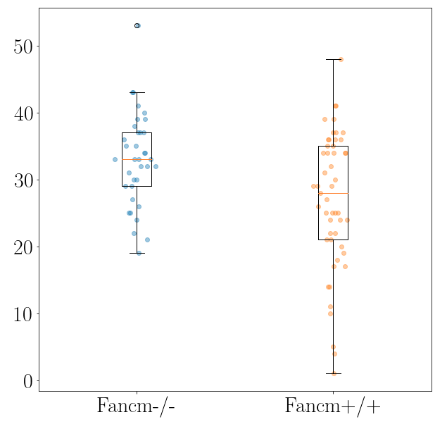
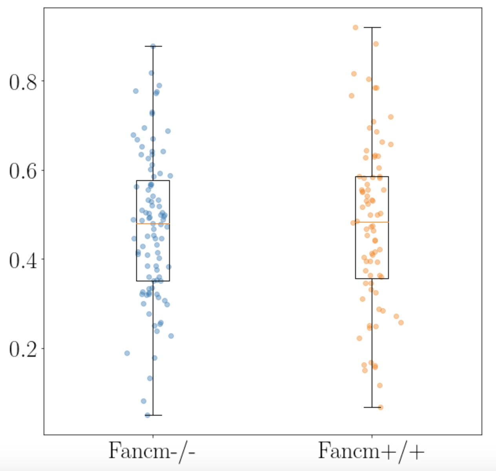

# synapsis

## Project overview

synapsis is an R package for analysing fluorescent microscopy images. In particular, its intended use is for analysing meiotic processes in mammals.

The main goal is to objectively count the number of meiotic crossovers on a per cell basis, in line with recent developments in ImageJ software. However, unlike using ImageJ, synapsis does not require a scientist to manually crop images around cells of interest.

Instead, synapsis identifies "good" cells in all images of a data set, crops around each per image, and then performs counting.

A single two channel image might look like the left colour image in the following figure:

*Figure 1: a two channel image of a meiotic spread. Antibody stains are SYCP3 (red, illuminates synaptonemal complexes) and MLH3 (green, illuminates sites of meiotic crossovers).*

which can also be separated into the two channels (greyscale, right).

Synapsis can take this image (or folders of images like this) and determine the number of coincident foci (green) with synaptonemal complexes ("SCs", red) per cell.

[comment]: <> (examples with this file MLH3rabbit488_SYCP3mouse594_fancm_fvb_x_fancm_bl6_725--_slide01_018.nd2)

## Contributors

Lucy McNeill, St Vincent's Institute of Medical Research

Wayne Crismani, St Vincent's Institute of Medical Research and the University of Melbourne

## Compatibility

synapsis relies heavily on the bioconductor package EBImage, which currently supports jpeg, png and tiff image files.

Currently, synapsis also supports

- [x] .nd2 (NIKON), see [nd2converter.py][], which converts a three channel image into three separate jpegs of foci, SC and DAPI (unused) channels from original .nd2 files.

## Using synapsis

synapsis has four main functions. These are:

- auto_crop

- get_pachytene

- count_foci

- measure_distances

We summarise them in the following subsections:

### auto_crop

input: Original grey scale image files of (1) Synaptonemal complexes ("SC", e.g. SYCP3 anti-body) and (2) foci (e.g. MLH1, MLH3 anti-body) channels from e.g. Nikon .nd2 files.

output: crops in SC (red) and foci (green) around individual cells.

### get_pachytene

input: crops in channels (1) (red) and (2) (green) around individual cells, from previous auto_crop.

output: only keeps crops if cells are in pachytene phase (based on channel (1))

### count_foci

input: crops of dna and foci channels in pachytene phase (from get_pachytene)

output: number of foci counts of synamtonemal complexes per cell (i.e. channel 1 coincident with channel 2) as a function of genotype.

### measure_distances

input:

output:

## Analysis

Once we have the foci counts (count_foci) and/or distance between foci along synaptonemal complexes (measure_distances), we can generate

- Histograms

- Boxplots

- Measures of statistical significance

with e.g. ANOVA testing.

## Project organisation and management

Please [issue][] bug reports through GitLab.

## Acknowledgements

This project is a [workflowr][] project, where we make use of a [project template][] created by Davis McCarthy.

[workflowr]: https://github.com/jdblischak/workflowr

[project template]: https://gitlab.svi.edu.au/biocellgen-public/aaaa_2019_project-template

[issue]: https://gitlab.svi.edu.au/lmcneill/synapsis/-/issues

[nd2converter.py]: https://gitlab.svi.edu.au/lmcneill/synapsis/source/nd2converter.py
